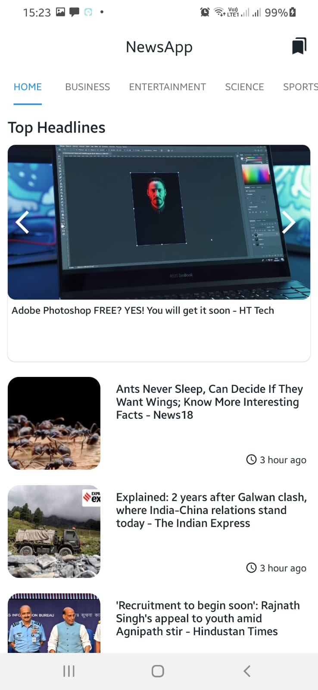
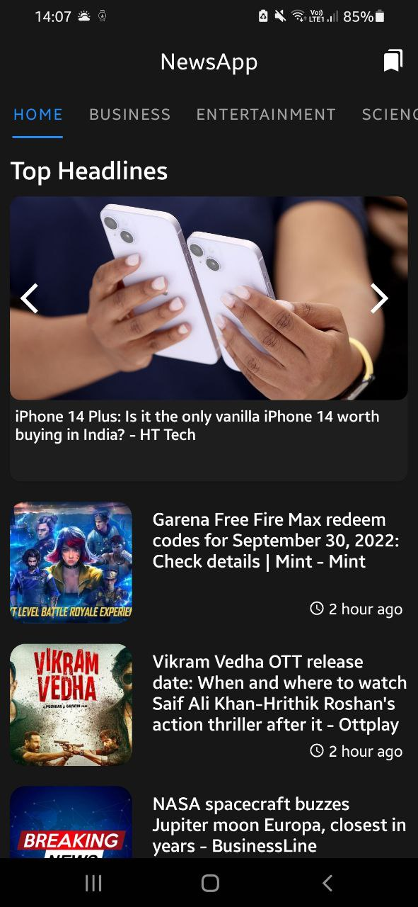
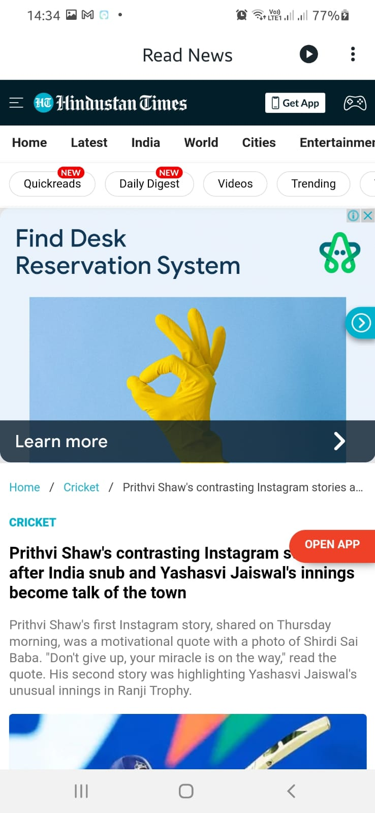
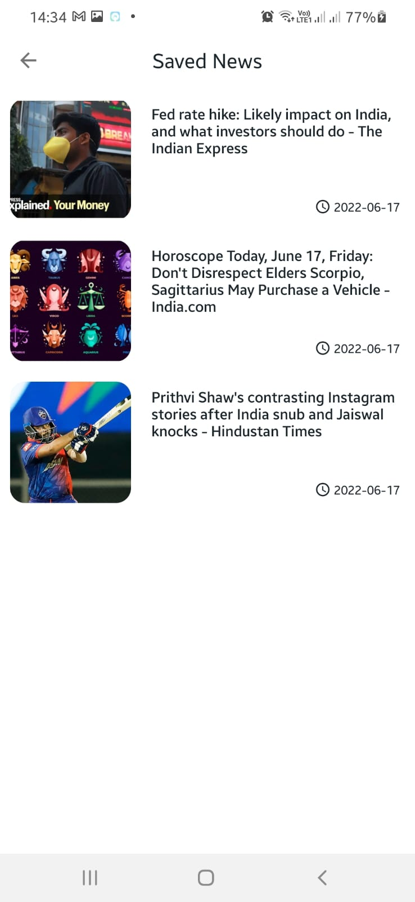
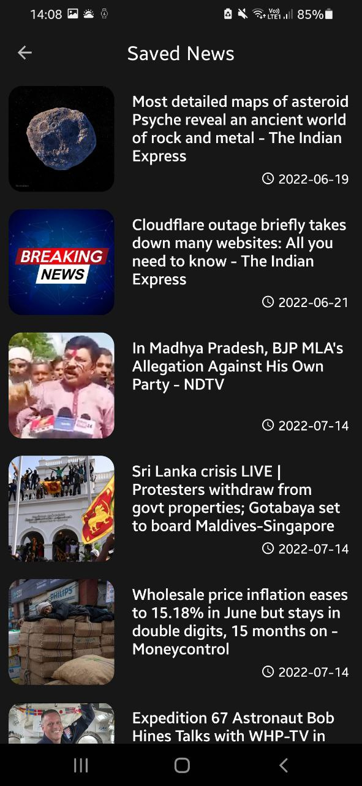

# News App 📰

A Kotlin Android app that keeps you up to date with the latest headlines —
categorized news, offline reading, full-text search, bookmarks, dark mode and
text-to-speech, built on a clean MVVM + Room architecture.

[](https://github.com/Raj-m01/News-App/actions/workflows/android-ci.yml)
[](https://kotlinlang.org/)
[](https://developer.android.com/about/versions/lollipop)
[](https://developer.android.com/about/versions/14)
[](LICENSE)

## ✨ Features

- 🗂 **7 category tabs** — Home (with a Top-Headlines carousel), Business,
  Entertainment, Science, Sports, Tech, Health
- 🔎 **Search** — full-text search with debounced queries and friendly
  no-result/error states
- 📴 **Offline support** — every feed is cached locally; the app renders
  instantly and refreshes in the background at most every 30 minutes
- 🔖 **Bookmarks** — save any story with one tap from the list or the reader,
  swipe to delete with Undo, works fully offline
- 🔄 **Pull-to-refresh** with per-tab retry buttons and clear error messages
  (quota, invalid key, offline — straight from the API)
- 🌗 **Dark mode** — follows the system setting with a refined night palette
- 🔊 **Listen to news** — built-in text-to-speech with adjustable speed
  (0.75x–2x)
- 📤 **Share** any story, or open it in the browser

## 📸 Screenshots

<table align="center">
  <tr>
    <td></td>
    <td></td>
    <td></td>
  </tr>
  <tr>
    <td></td>
    <td></td>
    <td></td>
  </tr>
</table>

## 🛠 Tech stack

| Area | Choice |
| --- | --- |
| Language | Kotlin 1.9, coroutines + Flow-free LiveData |
| Architecture | MVVM, Room as single source of truth |
| UI | XML views, Material Components, ViewBinding-free classic widgets, shimmer skeletons, ViewPager2 carousel |
| Persistence | Room 2.6 (offline cache + bookmarks), KSP |
| Networking | Retrofit 2.11 + OkHttp 4.12 (suspend functions), Gson |
| Images | Coil 2.6 |
| Time | `java.time` via core library desugaring |
| Testing | JUnit 4, MockWebServer |
| CI | GitHub Actions (build + unit tests) |

Full architecture write-up: [`docs/ARCHITECTURE.md`](docs/ARCHITECTURE.md).

## 🚀 Getting started

Detailed instructions live in [`docs/SETUP.md`](docs/SETUP.md). The short version:

1. **Get a free API key** from [NewsAPI.org](https://newsapi.org/) (the app
   self-throttles to stay inside the free tier).
2. **Add the key** to your user-level Gradle properties (keeps it out of git):

   ```bash
   echo 'NEWS_API_KEY=your_real_key_here' >> ~/.gradle/gradle.properties
   ```

3. **Build & run**

   ```bash
   ./gradlew :app:assembleDebug      # or just press Run in Android Studio
   ./gradlew :app:testDebugUnitTest  # unit tests
   ```

   Requirements: Android Studio Hedgehog+ / JDK 17. The project builds with a
   placeholder key too — you'll just see the API error screen until you add a
   real key.

## 📁 Project structure & docs

```
app/src/main/java/com/rtctek/newsapp/
├── MainActivity / SavedNewsActivity / ReadNewsActivity / SearchActivity
├── fragments/NewsListFragment     # single reusable tab fragment
├── adapters/                      # DiffUtil list adapter, carousel, tabs
├── architecture/                  # ViewModel, Repository, Room (DAO/DB)
├── retrofit/                      # NewsAPI interface + models
└── utils/                         # time, cache, network, constants
```

| Document | Contents |
| --- | --- |
| [`docs/ARCHITECTURE.md`](docs/ARCHITECTURE.md) | MVVM diagram, data flow, design decisions |
| [`docs/SETUP.md`](docs/SETUP.md) | API key, build, release, troubleshooting |
| [`docs/PROJECT_STRUCTURE.md`](docs/PROJECT_STRUCTURE.md) | Annotated file tree |
| [`docs/IMPROVEMENTS.md`](docs/IMPROVEMENTS.md) | Full audit: bugs fixed, performance, security, roadmap |
| [`docs/CHANGELOG.md`](docs/CHANGELOG.md) | Release notes (2.0.0 overhaul) |

## 🤝 Contributing

Contributions are always welcome! See
[CONTRIBUTING.md](CONTRIBUTING.md) for how to set the project up and open a
pull request.

## 📝 License

Copyright (c) 2022 Raj Manjrekar

This project is [MIT](LICENSE) licensed.
